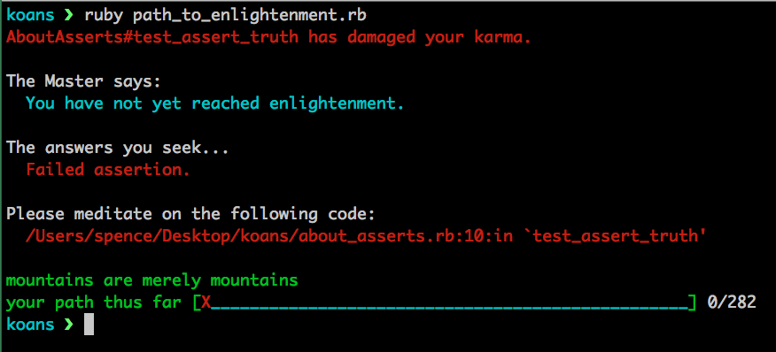

## Ruby Koans

Ruby koans are an extremely powerful tool to start learning the Ruby language on
a deeper level.  Koans consist of 282 tests that you need to make pass in order
to reach enlightenment.  They progressively get harder and more complex.

### Setup

-  [Visit this link and click on the red button "Download The
    Koans"](http://rubykoans.com/)  
-  In your downloads folder click on the file "rubykoans.zip"  

After you unzip the file it should create a koans folder.  Move that koans
folder to wherever you keep your programs or somewhere accessible like your
Desktop.

`cd` into your koans directory and then run: `ruby path_to_enlightenment.rb`

This is the main command you will be running in order to work your way through
all the koans.

Here is what you should see the first time running the command:

